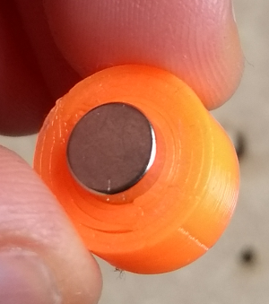

# Introduction
SCARA-seele is an open source project to design closed-loop SCARA robot which,
when finished, should include solid modeling of parts which should be either
laser cut or 3D printed (besides shafts, bearings, collars, couplers and other metallic pieces)

Source code for inverse kinematics and signal conditioning will
be released in dependant projects. [Kalman Filter for rotary sensor is already available](https://github.com/paucarre/stepper-kalman-filter)

# Solid modeling
The general topology of the SCARA robot will be an first linear actuator
that will lift the chained planar (angular) actuators. As the end effector
will have around 300mm length and the materials will be a mixture of MDF
and plastics, placing the linear actuator at the end of the end effector
it's very likely to cause serious structural problems.

## Angular Actuator

The angular actuator is designed using FreeCAD (open source parametric modeling)
using laser cut for cost reasons.
It uses a AS5448A magnetic rotatory sensor.
The solid modeling file is in `solid_modeling/angular.FCStd`
### FreeCAD Design

### Laser cut assembly

## Linear Actuator (lifter)
The linear actuator is designed using OpenSCAD. It could had been doing in
FreeCAD but due to the geometrical complexity of the edge joints the software
seemed unable to handle it (it constantly crashed and corrupted design ).
One of the advantages of OpenSCAD is that is very easy to programmatically
design the edge joints using loops.
It should be noted that both the top motor holder and the bottom sensor holder
will be 3d printed independently.
The solid modeling file is in `solid_modeling/lifter.scad`
### OpenSCAD Design

### Laser cut assembly

### Motor shaft to threaded shaft coupler

#### Design

#### 3D printed

### Linear Actuator Motor holder
#### Design

#### 3D printed

### Magnet-to-shaft press fit coupler for closed-loop control

#### 3D printed

